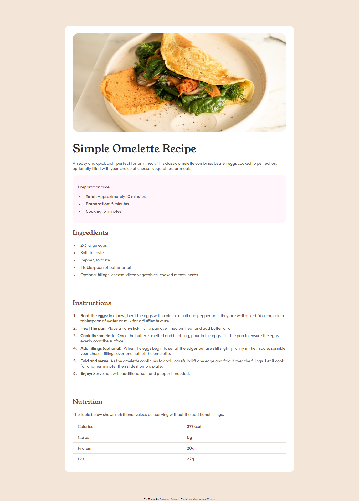
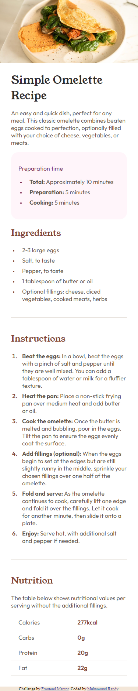

# Frontend Mentor - Recipe page solution

This is a solution to the [Recipe page challenge on Frontend Mentor](https://www.frontendmentor.io/challenges/recipe-page-KiTsR8QQKm). Frontend Mentor challenges help you improve your coding skills by building realistic projects.

## Table of contents

- [Overview](#overview)
  - [The challenge](#the-challenge)
  - [Screenshot](#screenshot)
  - [Links](#links)
- [My process](#my-process)
  - [Built with](#built-with)
  - [What I learned](#what-i-learned)
  - [Continued development](#continued-development)
  - [Useful resources](#useful-resources)
- [Author](#author)

## Overview

### Screenshot

Dekstop Preview


Mobile Preview


### Links

- Solution URL: [Github](https://github.com/MuhRandy/recipe-page-main-frontendmentor)
- Live Site URL: [Github Pages](https://muhrandy.github.io/recipe-page-main-frontendmentor/)

## My process

### Built with

- Semantic HTML5 markup
- CSS custom properties
- Flexbox
- Responsive

### What I learned

In this challenge, I learn how to change or wrapping specific words with HTML tag I want. This is useful when there repetitive word with similiar characteristics that we need to change or wrap with specific HTML tag. In my case, I need to wrap word with characteristics that before ':' in <li> with <strong> tag so it become bold and semantic.

To see how I do that, this is what I wrote on my javascript:

```js
// first I initialize the DOM that I need, in this case <li> elements. this listItems will store HTML collection of <li> elements
const listItems = document.getElementsByTagName("li");

// because listItems is HTML collection, I need to looping it to change or manipulate each element
for (const i in listItems) {
  const listItem = listItems[i];
  // this regex will become the search key for what word with characteristic I want, that is find any word and stop when you find ':'
  const regex = ".+?:";

  // to avoid error, I need to wrap it in this logic
  if (listItem.innerText !== undefined) {
    // this is where I store the word that I want to wrap with <strong> tag
    const textWantToChange = listItem.innerText.match(regex);

    // if it cant find what regex want it return null, so I need to wrap it in this if logic, and there one word that fulfill what regex want, but I dont want it, so I add logic that avoid change that word
    if (
      textWantToChange !== null &&
      textWantToChange[0] !== "Optional fillings:"
    ) {
      // oldText is for storing innerText on list item
      const oldText = listItem.innerText;
      // this is where I replace the word I want with replace() methode. replace methode accept two argument, first argument is regex for word you want to replace or change and the second one is for what replacement you want. In this case I just want to wrap it with <strong> tag
      const newText = oldText.replace(
        textWantToChange,
        `<strong>${textWantToChange[0]}</strong>`
      );

      // and here I use innerHTML because if I use innerText this will return string into element we manipulate. innerHTML will return HTML so <strong> tag will read as HTML tag not string
      listItem.innerHTML = newText;
    }
  }
}
```

### Continued development

Dont know yet

### Useful resources

- [W3School](https://www.w3schools.com/) - This helped me for almost anything, just like the documentation of HTML, CSS, and javascript.
- [Stack Overflow](https://stackoverflow.com/) - This is an amazing forum where you can ask or find someone with similiar problem you have that already solved.

## Author

- Website - [Muhammad Randy](https://mrandy-portfolio.web.app/)
- Frontend Mentor - [@MuhRandy](https://www.frontendmentor.io/profile/MuhRandy)
- Twitter - [@RandyThz](https://twitter.com/RandyThz)
